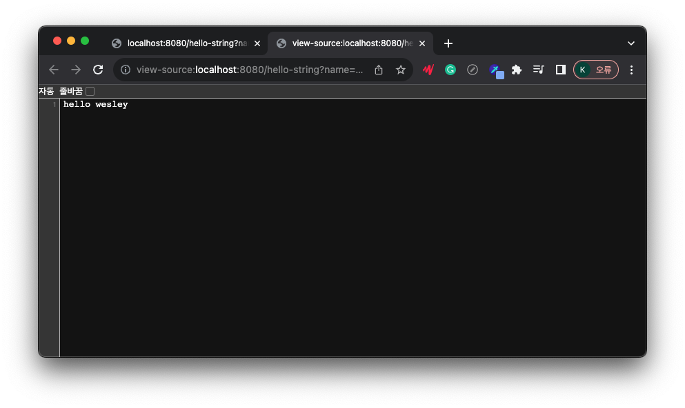

# API

HTML 으로 내릴지 API로 내릴지

```java
//API 방식의 맛보기 템플릿
@Controller //Controller import
public class HelloController {
    @GetMapping("hello-string")
    @ResponseBody //http의 body 부분에서 응답을 직접 넣어주겠다.
    public String helloString(@RequestParam("name") String name) {
        return "hello " + name;
    }
}
```

---
해당 url을 실행하면, MVC 모델과 동일하게 출력되는 것을 알 수 있다.

그러나 소스코드를 봤을 때,    
HTML로 내려진 것이 아니라   
API에서 보낸 코드가   
그대로 입력된 것을 알 수 있다.   
VIEW 템플릿이 없다는 것이다.

---

## API 방식을 사용하는 이유는?

````java
//API 방식의 정석 템플릿
@Controller //Controller import
public class HelloController {
    @GetMapping("hello-api")
    @ResponseBody
    public Hello helloApi(@RequestParam("name") String name) {
        Hello hello = new Hello();
        hello.setName(name); //setter
        return hello; //객체를 반환한다.
    }

    //Hello 객체를 생성한다.
    static class Hello {
        private String name;
        //getter-setter : property 접근 방식
        public String getName() {
            return name;
        }

        public void setName(String name) {
            this.name = name;
        }
    }
}
````
해당 코드를 실행하였을 때

어? 아까와는 다른 결과가 나왔다.

이는 JSON 방식(key - value)으로 나온 것이다.  
name 은 wesley 이런 식으로 JSON 반환방식으로 세팅되어 있다.   

## 동작방식    
   
웹 브라우저에서 8080을 친다.   
톰캣에서 이를 스프링에 보내준다.   
@ResponseBody 어노테이션을 발견한다.     
이때는 API를 그대로 넘겨준다.    
문자의 경우 그냥 문자만 넘겨주면 되지만, 
객체를 넘겨줘야 하는 상황이다.   
이때 자바는 JSON방식을 채택하여서 넘겨주게 되는 것이다.   
JSON converter가 작동해서 이를 웹 브라우저에 넘겨준다.
