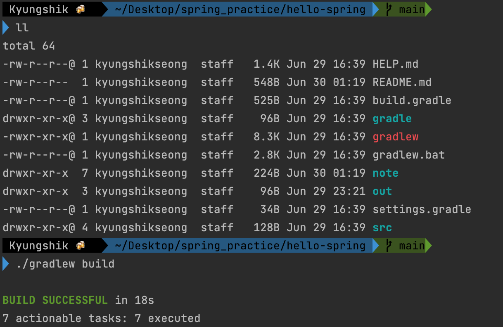
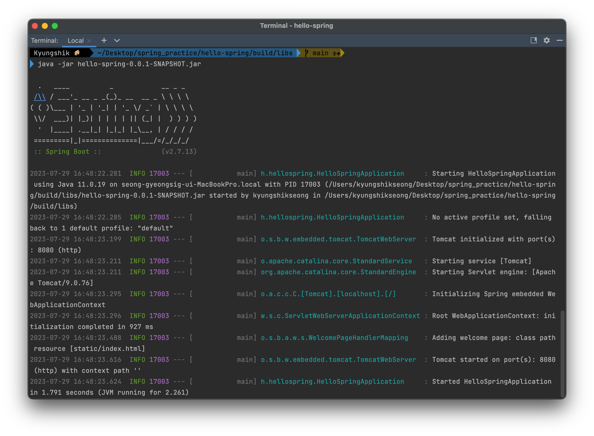

# 빌드하기

1. 터미널에서 해당 로컬 폴더로 이동하기
   ```
   cd hello-spring  
   ```
2. 빌드하기
    ```
   ./gradlew build
    ```
   
3. 빌드에 성공한 후 build 폴더로 이동한다. 
   - build -> libs -> hello-spring-0.0.1-SNAPSHOT.jar
    ```
      cd build
      ll
      cd libs
      ls -arlth  
   ```
4. hello-spring-0.0.1-SNAPSHOT.jar 파일을 실행한다.
   ```
   java -jar hello-spring-0.0.1-SNAPSHOT.jar 
   ```

성공적으로 빌드 되었다.
