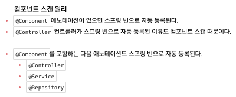

# Welcome Page 만들기

웹의 초기 페이지는 index.html로 시작한다.   
이를 지키지 않았을 때 배포 시 루트 페이지를 따로 설정해줘야 하는 번거로움이 있다.

index.html를 static에 저장한다. 경로 : main/resources/static    
static/index.html을 올려두면 자동으로 welcome page 기능을 제공한다.

```html
<!DOCTYPE html>
<html lang="en">
<head>
    <meta charset="UTF-8">
    <title>Hello spring</title>
</head>
<body>
Hello spring
<a href="/hello">hello</a>
</body>
</html>
```   
localhost:8080에서 제대로 잘 실행되는 것을 볼 수 있다.



