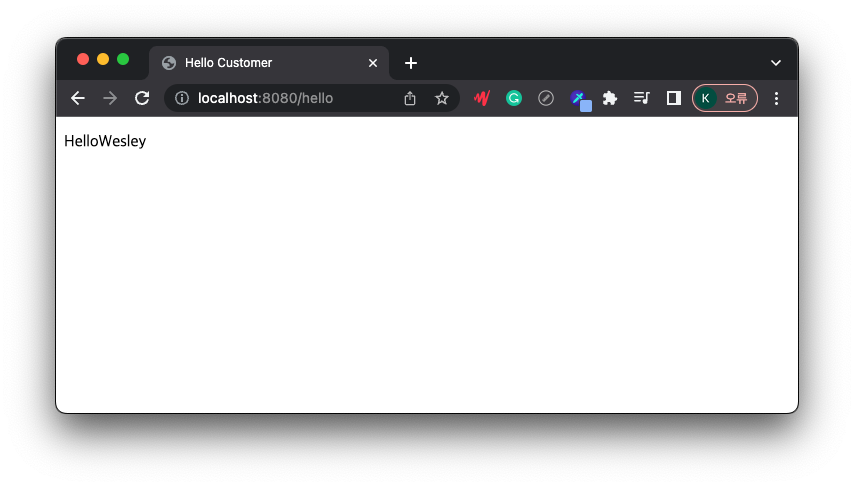

# Welcome_Page 만들기

웹의 초기 페이지는 index.html로 시작한다.   
이를 지키지 않았을 때 배포 시 루트 페이지를 따로 설정해줘야 하는 번거로움이 있다.

index.html를 static에 저장한다. 경로 : main/resources/static    
static/index.html을 올려두면 자동으로 welcome page 기능을 제공한다.

```html
<!DOCTYPE html>
<html lang="en">
<head>
    <meta charset="UTF-8">
    <title>Hello spring</title>
</head>
<body>
Hello spring
<a href="/hello">hello</a>
</body>
</html>
```


localhost:8080에서 제대로 잘 실행되는 것을 볼 수 있다.
index.html에서 하이퍼 참조를 통해 /hello 로 가는 링크를 만들었다.
해당 링크를 클릭하였을 때 동작할 수 있게하는 프로그램을 만든다.
---- 

## Controller와 Thymeleaf

* Controller : Web application 에서의 첫번째 진입지점
    * hello.hellospring에 controller 패키지를 생성한다.
    * HelloController 클래스를 생성한다.
```java
package hello.hellospring.controller;

import org.springframework.stereotype.Controller;
import org.springframework.ui.Model;
import org.springframework.web.bind.annotation.GetMapping;

@Controller //Controller import
public class HelloController {
    @GetMapping("hello") //hello를 호출한다.
    public String hello(Model model) {
        model.addAttribute("data", "Wesley");
        return "hello";
    }
}
```
* Thymeleaf 엔진 설정
  * resources/templates 경로에서 hello.html을 생성한다.
  * HelloController.java 에서 data로 Wesley로 설정했다.
  * html을 실행했을 때 ${data} 부분이 Wesley로 출력될 것이다. 
```html
<!DOCTYPE html>
<html xmlns:th="http://www.thymeleaf.org" lang="en">
<head>
    <meta charset="UTF-8">
    <title>Hello Customer</title>
</head>
<body>
<p th:text="Hello + ${data}">Greetings</p>
</body>
</html>
```

  


