# h2 데이터베이스 설치하기

1. 웹페이지 접속   
   h2 데이터베이스 웹페이지.
   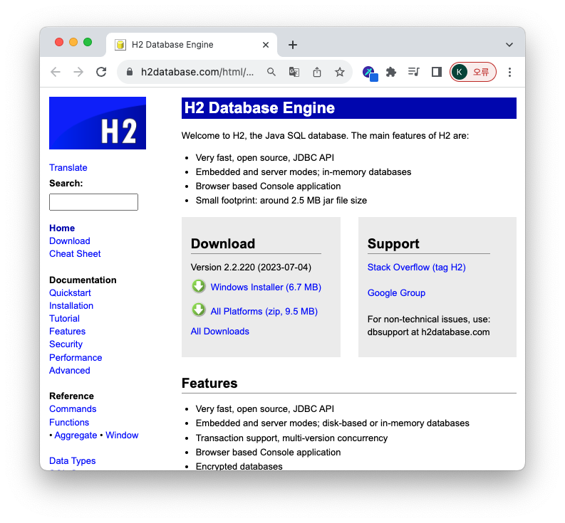   
   https://www.h2database.com/html/main.html

---

2. 동일한 개발환경   
   강의와 동일한 개발환경을 위해서 동일한 버전인 1.4.200을 설치한다.
   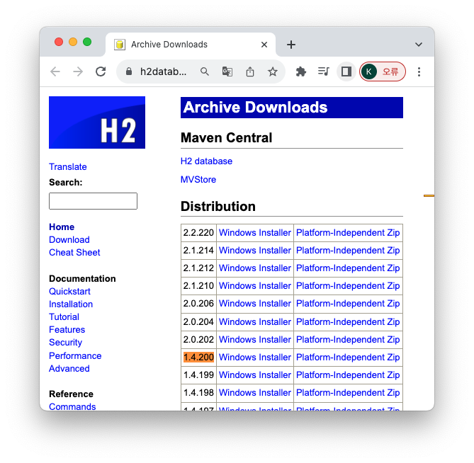   
   https://www.h2database.com/html/download-archive.html   
   위의 url에 들어가서 1.4.200 버전을 검색해서 다운받는다.

---

3. 파일 설치

- 다운 받은 후 터미널에서 h2 파일에 접근한다.      
  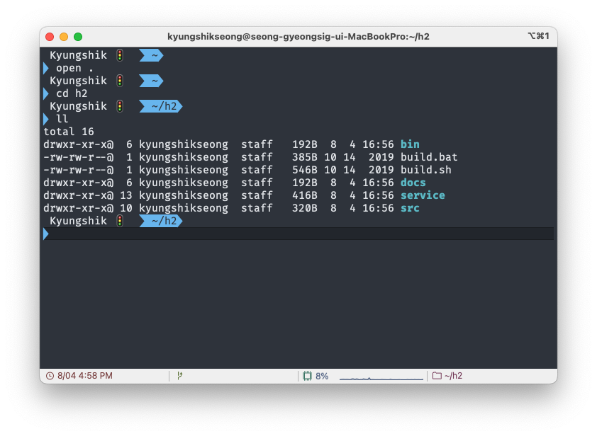
- bin에 들어가보면 h2.sh 라는 실행파일이 있다.
- 권한을 부여한다.
- 실행한다.
  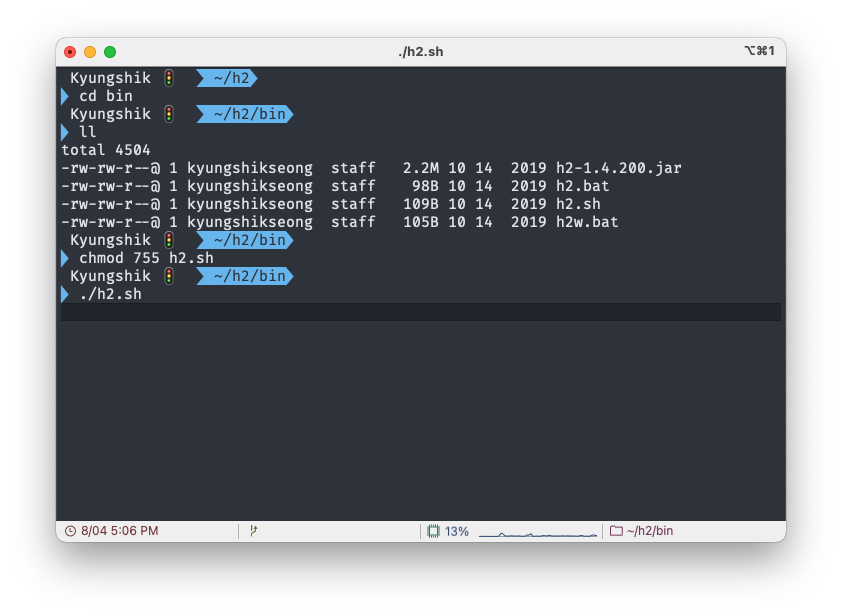
  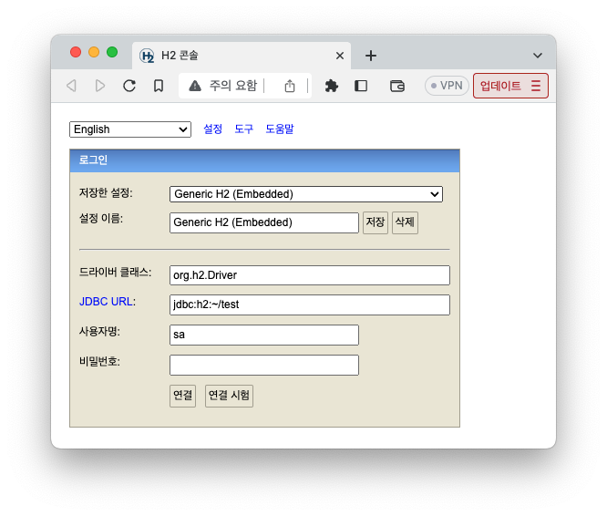
- IP 이슈로 되지 않을 때는 url에 앞부분에 localhost: 를 작성한다.
- 연결을 누르면 아래와 같은 콘솔이 실행된다.    
  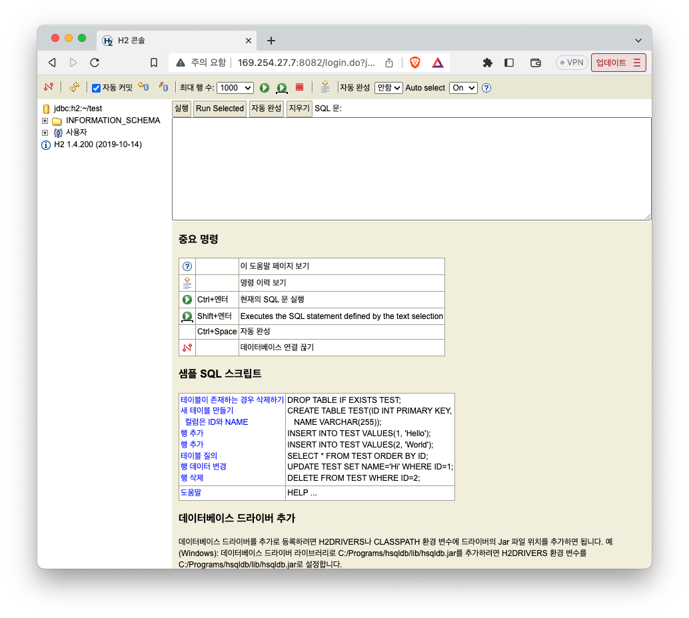

---

4. 나가기

- 왼쪽 상단에 체리가 붙어있는 N 버튼
- 나간 후에는 home에 test.mv.db가 있는 것을 확인해야 한다.
- 명령어: ll -arth
  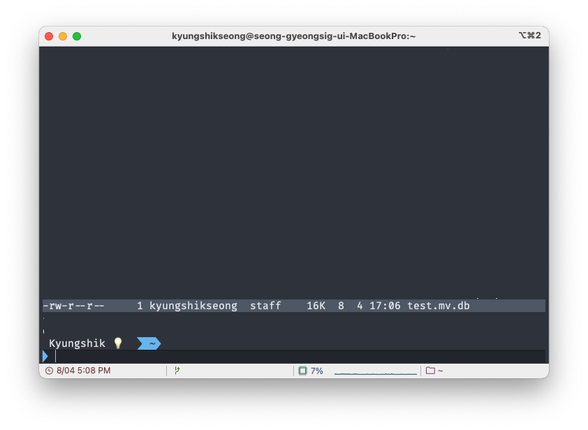

---

5. 충돌방지하기

- 이후 실행할 때는 애플리케이션의 충돌방지를 위해서,
- JDBC URL을 아래와 같이 localhost로 설정해야 한다.
- jdbc:h2:tcp://localhost/~/test          
  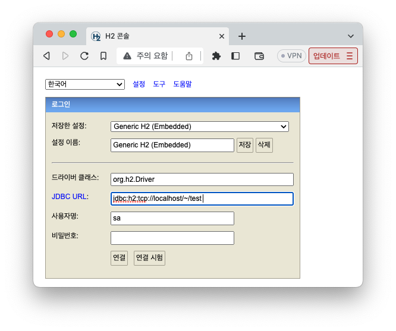   
  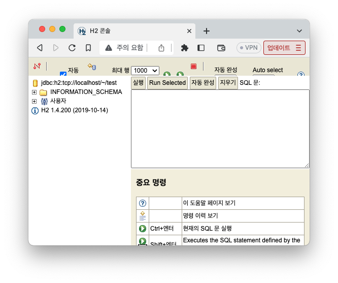

---

6. 테이블 생성

```mysql
create table member
(
    id   bigint generated by default as identity,
    name varchar(255),
    primary key (id)
);
```
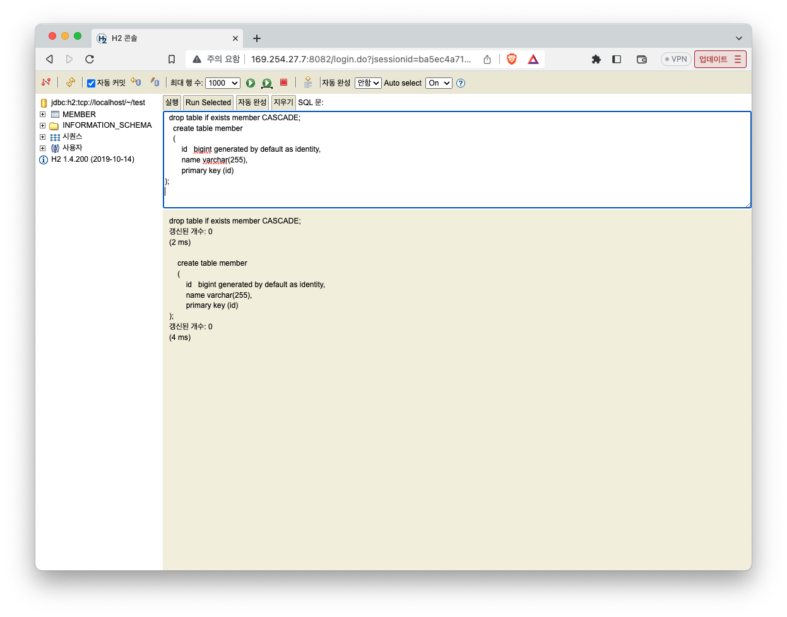
왼쪽 창에 MEMBER라는 테이블이 실행되었다.
잘 실행되었는지 확인하기 위해서는 MEMBER 테이블을 클릭하면,
전체 조회 쿼리가 실행된다.
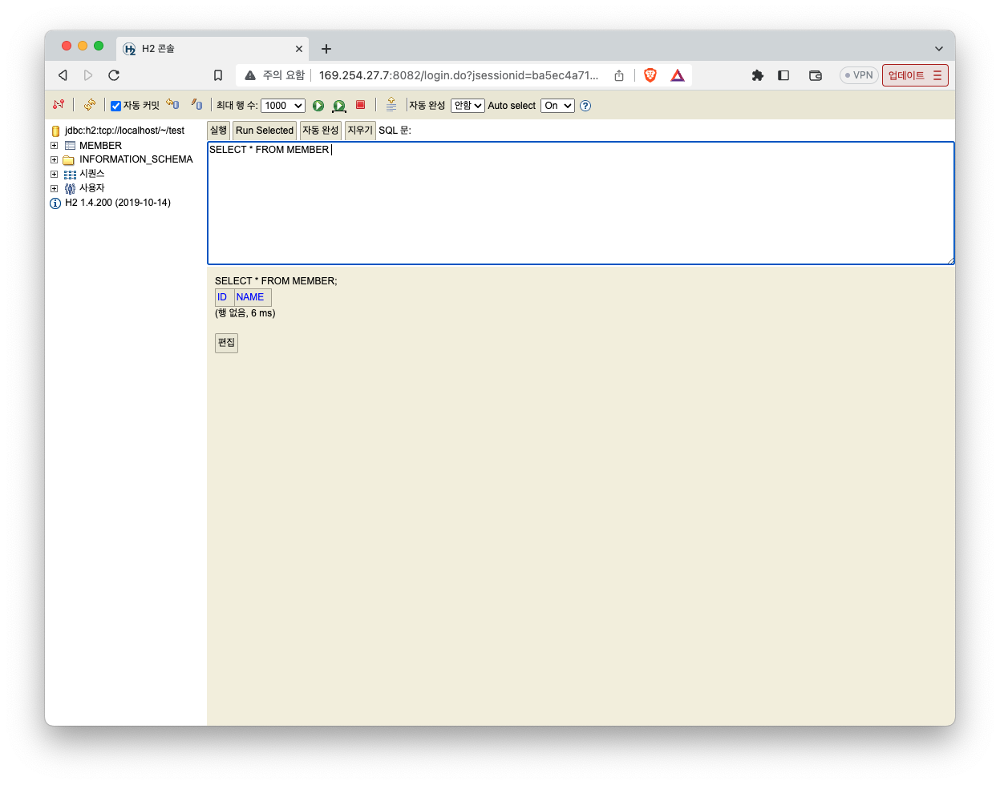
---
7. 스프링 부트에서 SQL 관리하기.
hello-spring 경로에 sql 디렉토리를 만든다.   
ddl.sql 을 생성한다.   
해당 파일을 보고 소스코드를 관리할 수 있다.
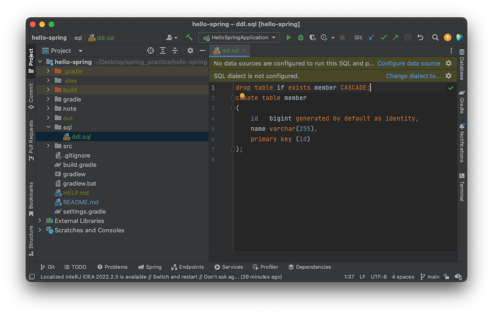