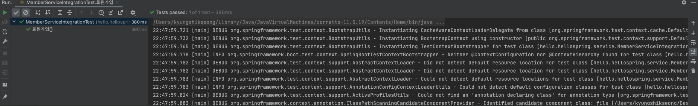
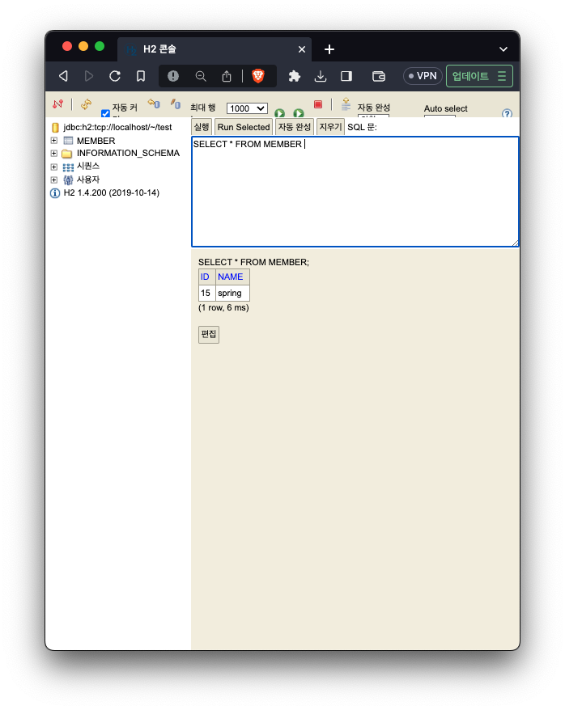

# JPA

### JDBC에서 작성하는 쿼리 없이 실행할 수 있는 기능.

### JPA가 중간에서 DB 처리를 해주기 때문에 개발 효율성을 높일 수 있다.

### 데이터 중심 설계 -> 객체 중심 설계

### 개발 생산성 향상

    
---

- JPA는 기존의 반복 코드는 물론이고, 기본적인 SQL도 JPA가 직접 만들어서 실행해준다.
- JPA를 사용하면, SQL과 데이터 중심의 설계에서 객체 중심의 설계로 패러다임을 전환을 할 수 있다.
- JPA를 사용하면 개발 생산성을 크게 높일 수 있다.

---

## 1. 라이브러리 추가하기

build.gradle    
추가: implementation 'org.springframework.boot:spring-boot-starter-data-jpa:'

````gradle  
plugins {
	id 'java'
	id 'org.springframework.boot' version '2.7.13'
	id 'io.spring.dependency-management' version '1.0.15.RELEASE'
}

group = 'hello'
version = '0.0.1-SNAPSHOT'

java {
	sourceCompatibility = '11'
}

repositories {
	mavenCentral()
}

dependencies {
	implementation 'org.springframework.boot:spring-boot-starter-thymeleaf'
	implementation 'org.springframework.boot:spring-boot-starter-web'
	//implementation 'org.springframework.boot:spring-boot-starter-jdbc'
	implementation 'org.springframework.boot:spring-boot-starter-data-jpa:'
	runtimeOnly 'com.h2database:h2'
	testImplementation 'org.springframework.boot:spring-boot-starter-test'
}

tasks.named('test') {
	useJUnitPlatform()
}

````

---

### 2. application.properties 기능 추가

```properties
spring.datasource.url=jdbc:h2:tcp://localhost/~/test
spring.datasource.driver-class-name=org.h2.Driver
spring.datasource.username=sa
spring.jpa.show-sql=true
spring.jpa.hibernate.ddl-auto=none

```

---

### 3. 엔티티 Mapping

Member.java에서 객체와 ORM을 @로 추가한다.

````java
package hello.hellospring.domain;

import javax.persistence.Entity;
import javax.persistence.GeneratedValue;
import javax.persistence.GenerationType;
import javax.persistence.Id;

@Entity
public class Member {
    //비즈니스 요구사항
    @Id
    @GeneratedValue(strategy = GenerationType.IDENTITY) //ID - DB가 알아서 자동생성
    private Long id;
    private String name;

    public Long getId() {
        return id;
    }

    public void setId(Long id) {
        this.id = id;
    }

    public String getName() {
        return name;
    }

    public void setName(String name) {
        this.name = name;
    }
}
````

### 4. 리포지토리 생성

JpaMemberRepository

````java
package hello.hellospring.repository;

import hello.hellospring.domain.Member;

import javax.persistence.EntityManager;
import java.util.List;
import java.util.Optional;

public class JpaMemberRepository implements MemberRepository {

    //1. Jpa를 사용하기 위해서 EntityManager를 주입 받아야 한다.
    private final EntityManager em;

    public JpaMemberRepository(EntityManager em) {
        this.em = em;
    }

    @Override
    public Member save(Member member) {
        em.persist(member);
        return member;
    }

    @Override
    public Optional<Member> findById(Long id) {
        Member member = em.find(Member.class, id);
        return Optional.ofNullable(member);
    }

    @Override
    public Optional<Member> findByName(String name) {
        List<Member> result = em.createQuery("select m from Member m where m.name = :name", Member.class)
                .setParameter("name", name)
                .getResultList();

        return result.stream().findAny();
    }

    @Override
    public List<Member> findAll() {
        return em.createQuery("select  m from Member m", Member.class)
                .getResultList();
    }
}
````
MemberService.java 에다가 @Transactional 을 입력한다.
```java
@Transactional
public class MemberService {
    //1. 회원 서비스를 만들기 위해서 리포지토리를 선언한다.
    private final MemberRepository memberRepository;

    public MemberService(MemberRepository memberRepository) {
        this.memberRepository = memberRepository;
    }


    //2. 회원가입
    public Long join(Member member) {
        //2. 같은 이름이 있는 중복 회원 X
        validateDuplicateMember(member);
        //1. 회원을 저장한다.
        memberRepository.save(member);
        return member.getId();

    }
}
```
---
Test 해본다.   
   



