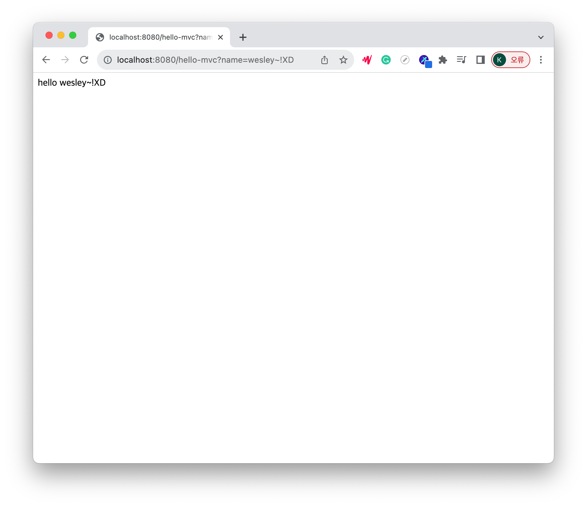

# MVC
1. MVC   
   MVC 패턴을 이용해 Model, View, Cotroller로 나누어 웹을 개발하면 클라이언트가 서버에 웹 문서를 요청할 경우, HTML을 동적으로 바꾸어 응답해줍니다.

   - Model: 데이터와 비즈니스 로직을 관리     
              모델은 앱이 포함해야할 데이터가 무엇인지를 정의합니다.    
              데이터의 상태가 변경되면 모델을 일반적으로 뷰에게 알리며
              (따라서 필요한대로 화면을 변경할 수 있습니다)    
              가끔 컨트롤러에게 알리기도 합니다(업데이트된 뷰를 제거하기 위해 다른 로직이 필요한 경우).   
              다시 쇼핑 리스트 앱으로 돌아가서, 모델은 리스트 항목이 포함해야 하는 데이터 — 품목, 가격, 등. — 와 이미 존재하는 리스트 항목이 무엇인지를 지정합니다.
   - View: 화면과 레이아웃등 보여지는 것들    
           뷰는 앱의 데이터를 보여주는 방식을 정의합니다.       
           쇼핑 리스트 앱에서, 뷰는 항목이 사용자에게 보여지는 방식을 정의하며,  
           표시할 데이터를 모델로부터 받습니다.
   - Controller: 명령을 모델과 뷰 사이에서 라우팅.      
                 컨트롤러는 앱의 사용자로부터의 입력에 대한 응답으로 모델 및/또는 뷰를 업데이트하는 로직을 포함합니다.    
                 예를 들어보면, 쇼핑 리스트는 항목을 추가하거나 제거할 수 있게 해주는 입력 폼과 버튼을 갖습니다.     
                 이러한 액션들은 모델이 업데이트되는 것이므로 입력이 컨트롤러에게 전송되고,     
                 모델을 적당하게 처리한다음, 업데이트된 데이터를 뷰로 전송합니다.     
                 단순히 데이터를 다른 형태로 나타내기 위해 뷰를 업데이트하고 싶을 수도 있습니다    
                 (예를 들면, 항목을 알파벳순서로 정렬한다거나, 가격이 낮은 순서 또는 높은 순서로 정렬). 
                 이런 경우에 컨트롤러는 모델을 업데이트할 필요 없이 바로 처리할 수 있습니다.   
---
2. Controller 만들기   
경로 : src/main/java/hello.hellospring/controller/HelloController.java
```java
@Controller
  public class HelloController {
      @GetMapping("hello-mvc")
      public String helloMvc(@RequestParam("name") String name, Model model) {
          model.addAttribute("name", name);
          return "hello-template";
      }
}
```
3. View 만들기   
경로 : src/resources/static/hello-template.html
````html
<html xmlns:th="http://www.thymeleaf.org">
<body>
<p th:text="'hello ' + ${name}">hello! empty</p>
</body>
</html>
````
4. 실행   
   http://localhost:8080/hello-mvc?name=wesley~!XD
    