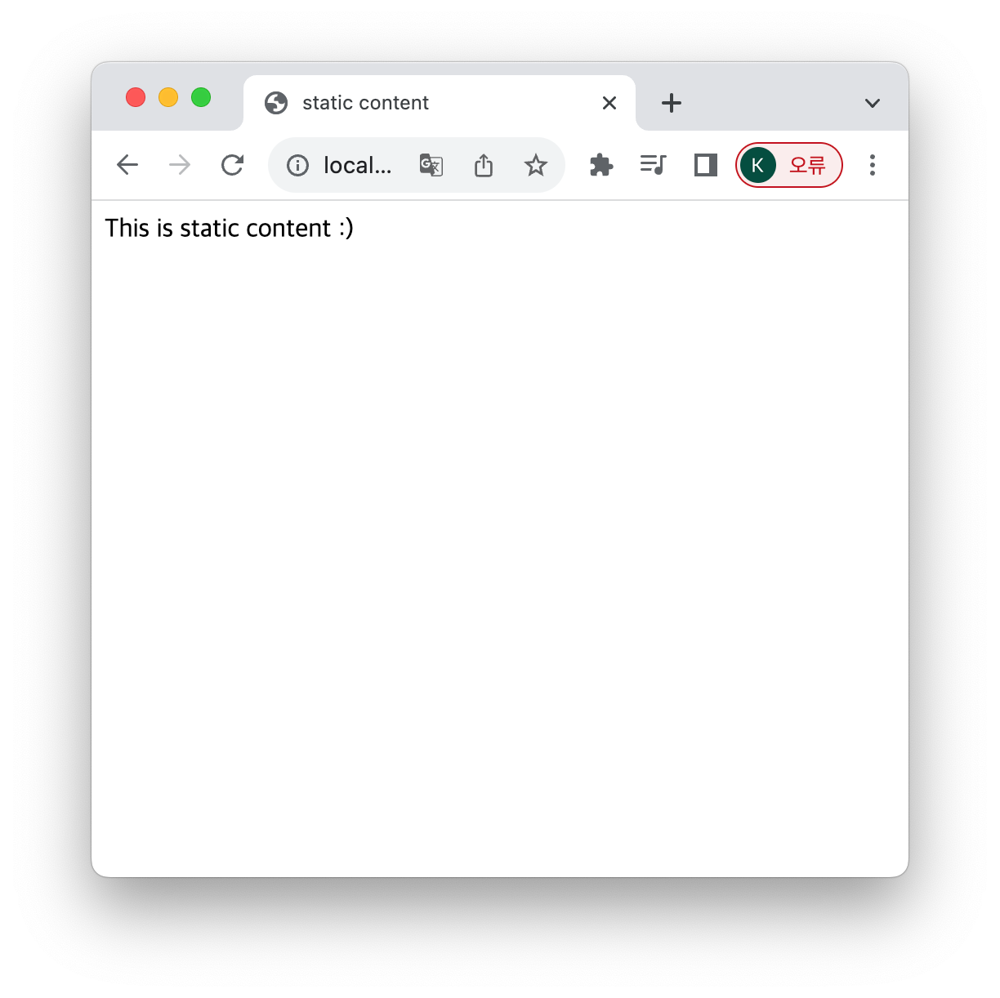

# 정적 컨텐츠

1. 정적 컨텐츠 설명   
   - 클라이언트의 요청을 받고 서버에 미리 저장된 HTML, CSS, JS 등의 파일을 그대로 응답해 보여주는 것을 말합니다.
   - 모든 클라이언트들의 요청에 대해 동일한 결과를 보여줍니다.
2. 스프링 부트에서의 정적 컨텐츠
   - 스프링 부트에서는 기본적으로 정적 컨텐츠 기능을 제공한다.
   - main/resources/static/ 경로에 hello-static.html 파일을 생성한다.
    ````html
    <!DOCTYPE HTML>
    <html>
    <head>
        <title>static content</title>
        <meta http-equiv="Content-Type" content="text/html; charset=UTF-8"/>
    </head>
    <body>
    This is static content :)
    </body>
    </html>
    ````
3. 빌드하여 해당 정적 컨텐츠를 확인한다.   
   - 해당 로컬 사이트에 들어가서 정적 컨텐츠를 확인한다.
   - http://localhost:8080/hello-static.html
   
4. 정적 컨텐츠 구조 
   - 웹브라우저에서 http://localhost:8080/hello-static.html 요청을 보낸다.
   - 내장 톰켓 서버 -> 스프링 컨테이너
   - 우선적으로 관련 컨트롤러를 확인한다.
   - 해당 컨트롤러가 없으니까, 정적 컨텐츠로 제공한다.