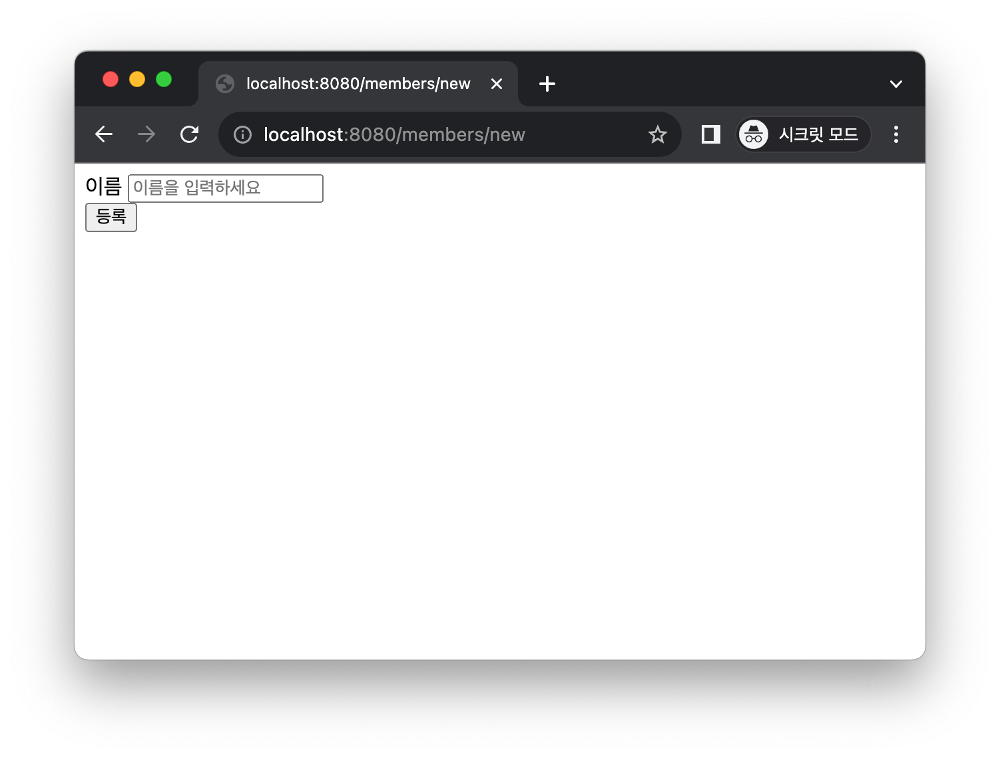
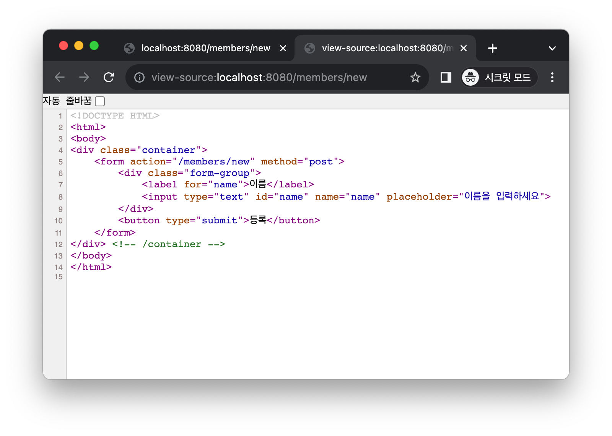
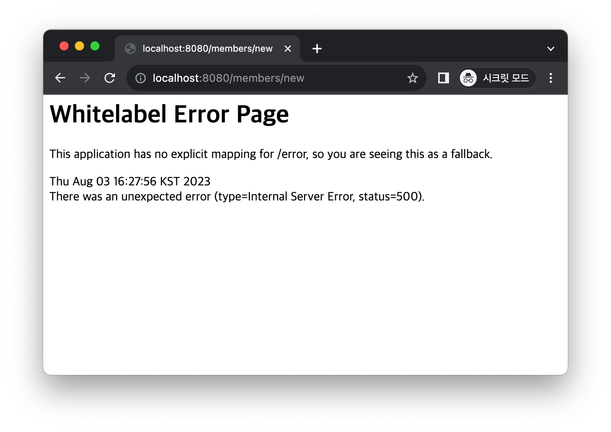
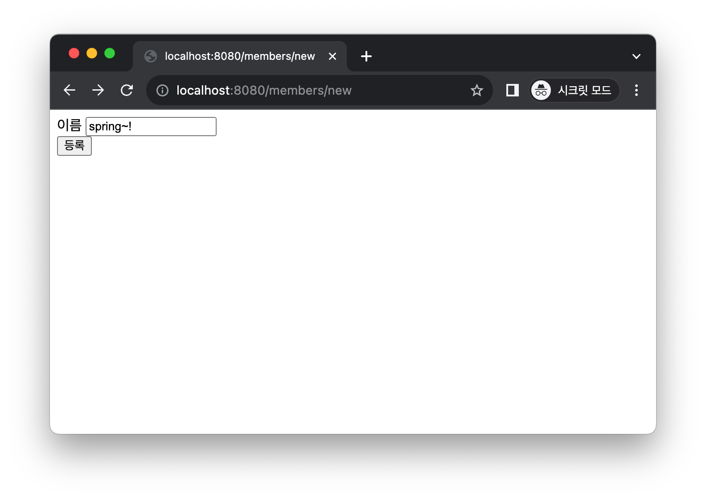
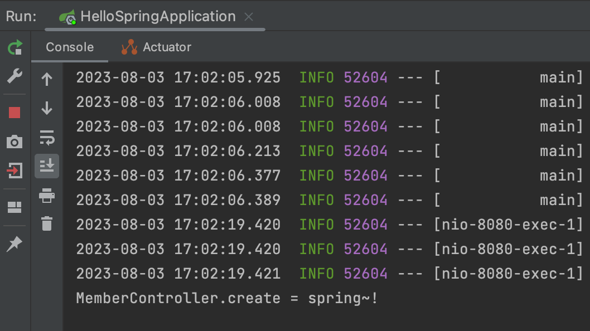

# 회원 웹 기능 - 등록

1. MemberController에서  
   @GetMapping("/members/new")를 선언한다.  
   localhost:8080/members/new url로 경로설정을 하는 것이다.   
   public String createForm()을 선언한다.
   return은 members/createMemberForm으로 이동한다.

```java
@GetMapping("/members/new")
public String createForm(){
        return"members/createMemberForm";
}
```

2. ~/templates 경로에 members폴더를 만들고   
   createMemberForm.html 파일을 생성한다.

````html
<!DOCTYPE HTML>
<html xmlns:th="http://www.thymeleaf.org">
<body>
<div class="container">
    <form action="/members/new" method="post">
        <div class="form-group">
            <label for="name">이름</label>
            <input type="text" id="name" name="name" placeholder="이름을 입력하세요">
        </div>
        <button type="submit">등록</button>
    </form>
</div> <!-- /container -->
</body>
</html>
````

3. 실행한다.
   실행결과는 아래와 같다.
   
   
   ~/members/new 경로에 createMemberForm.html 소스가 잘 반영되었다.   
   이를 통해 회원등록을하는 껍데기가 완성되었다.

---

4. 회원 등록을 위한 controller 만들기.   
   ~/Controller 경로에서 MemberForm 클래스를 만든다.    
   private String name 을 선언한다.   
   Generate(cmd+n)기능을 이용해서 getter와 setter를 선언한다.

```java
package hello.hellospring.controller;

public class MemberForm {
    public String name;

    public String getName() {
        return name;
    }

    public void setName(String name) {
        this.name = name;
    }
}
```

createMemberForm.html에서 매칭이 되면서 name 변수에 저장된다.

```html
<input type="text" id="name" name="name" placeholder="이름을 입력하세요">
```

실제 MemberController에 해당 값을 반영해야 한다.   
MemberForm에서 받아온 값을 MemberController에서 반영하기 위해서   
create(MemberForm form) <- 이렇게 선언할 수 있다.

```java
public String create(MemberForm form)
``` 

@PostMapping 에노테이션을 설정한다.  
Member 변수를 선언한다.  
form에서 Name을 받아온다.   
join을 통해서 member를 넘긴다.  
회원가입이 끝나면 home 화면으로 돌아간다.

```java
@PostMapping("/members/new")
public String create(MemberForm form){
        // Member를 선언한다.
        Member member=new Member();
        
        member.setName(form.getName());
        
        // join을 통해서 member를 넘긴다.
        memberService.join(member);
        
        // 회원가입이 끝나면 home 화면으로 돌린다.
        return redirect:/"";
}
```
실행결과  

이름을 입력하고 난 후   
아무일도 일어나지 않고 홈으로 돌아갔다.  

---
### 원리설명

회원가입에 들어간다. members/new로 들어간다는 것이다.
localhost:8080/members/new 이런식으로  
직접적인 주소로 들어가는 것을  
GET 방식이라고 한다.  
MemberController에서 createForm()을 호출한다.
```java
    @GetMapping("/members/new")
    public String createForm(){
        return "members/createMemberForm";
    }
```
해당 함수는 createMemberFrom.html을 호출한다.    
html에서 form이라는 태그를 통해 값을 입력하고 전달할 수 있다.   
````html
    <form action="/members/new" method="post">
        <div class="form-group">
            <label for="name">이름</label>
            <input type="text" id="name" name="name" placeholder="이름을 입력하세요">
        </div>
        <button type="submit">등록</button>
    </form>
````
### form 태그 분석하기   
action은 "/members/new"로 되어있고  
method는 post로 되어있다.   
input에서 name="name"은 서버로 넘어갈 때,   
name이라는 값(키)로 넘긴다는 것을 의미한다.   
input에 이름을 넣어 등록을 하면 action에 따라 값을 서버로 넘긴다.  
method에 post라고 되어있으니, post 방식으로 넘기는 것이다.  
      
MemberController에서 @PostMapping 부분으로 값을 넘긴다.    
- PostMapping은 form에 값을 넣어서 전달할 때 사용되는 에노테이션이다.   
- GetMapping은 정보 및 값을 조회할 때 사용하는 에노테이션이다.   
url은 동일하지만, Post와 Get에 따라서 다르게 사용할 수 있다.
```java
    @PostMapping("/members/new")
    public String create(MemberForm form) {
        Member member = new Member();
        member.setName(form.getName());

        memberService.join(member);

        return "redirect:/";
    }
```
MemberForm을 조회하여 값을 가져온다.
```java
package hello.hellospring.controller;

public class MemberForm {
    public String name;

    public String getName() {
        return name;
    }

    public void setName(String name) {
        this.name = name;
    }
}
```
MemberForm에 name 변수가 있다.   
name에 회원가입할 때 넣었던 "spring"이 들어가게 된다.   
spring이 setName을 호출해서 값을 넣어준다.   
MemberController에서 이를 getName으로 꺼내준다.  
   
직접 찍어보고 확인하기.

   


