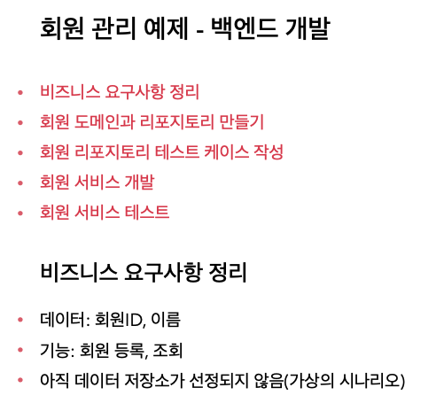
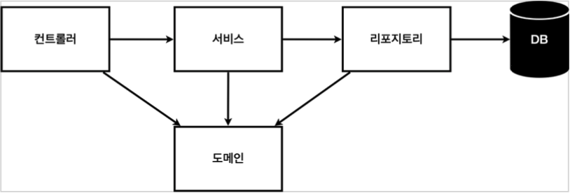
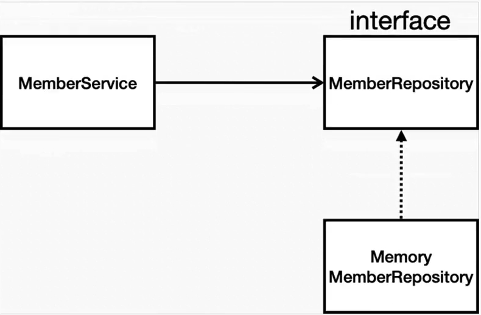

# 비즈니스 요구사항

1. 일반적인 웹 애플리케이션 계층 구조
 
 컨트롤러 - 서비스 - 리포지토리 - 도메인 (+DB) 구조로 되어있다.   
- 컨트롤러: 웹 MVC의 컨트롤러 역할   
- 서비스: 핵심 비즈니스 로직 구현 (ex_회원 ID는 중복이 안됨)   
- 리포지토리: 데이터베이스에 접근, 도메인 객체를 DB에 저장하고 관리    
- 도메인: 비즈니스 도메인 객체 

2. 클래스 의존관계

- 회원 서비스 로직 : MemberService<회원 서비스>
- 인터페이스 : MemberRepository<회원 리포지토리> _ 아직 데이터 저장소가 선정되지 않아서(?) -> 나중에 선정되면 
- 구현체 : MemoryMemberRepository _ 메모리모드로 단순한 구현체를 개발한다. 나중에 RDB, NoSQL --
