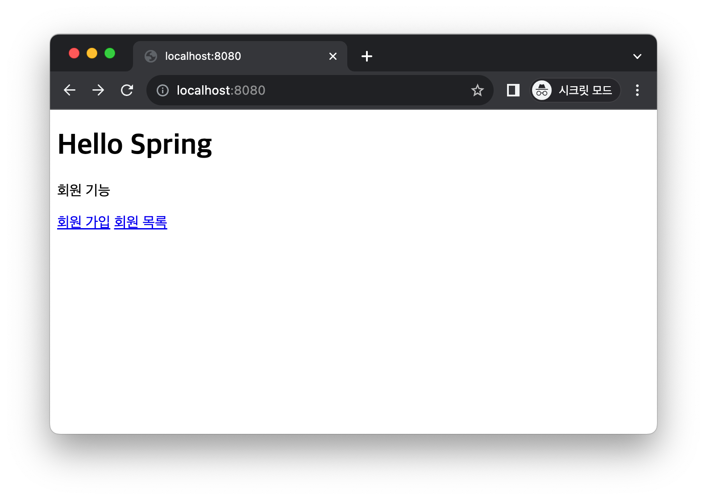
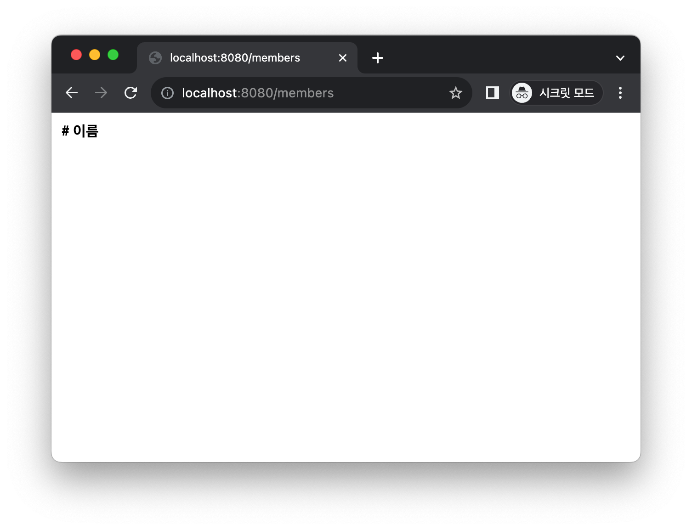
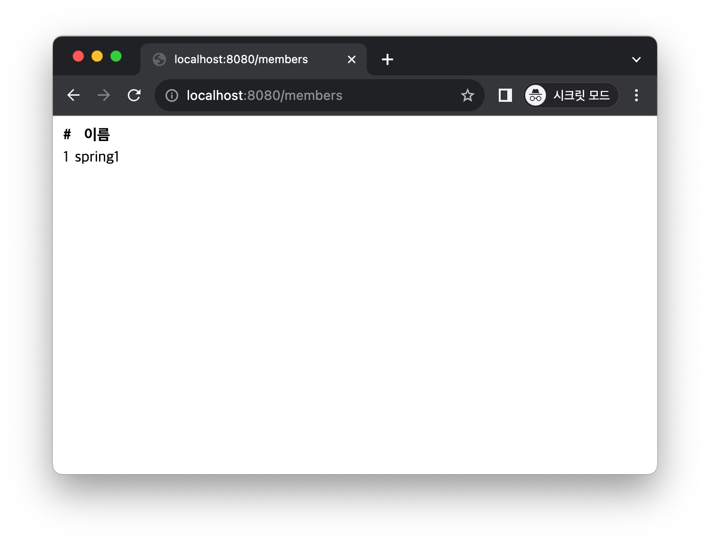
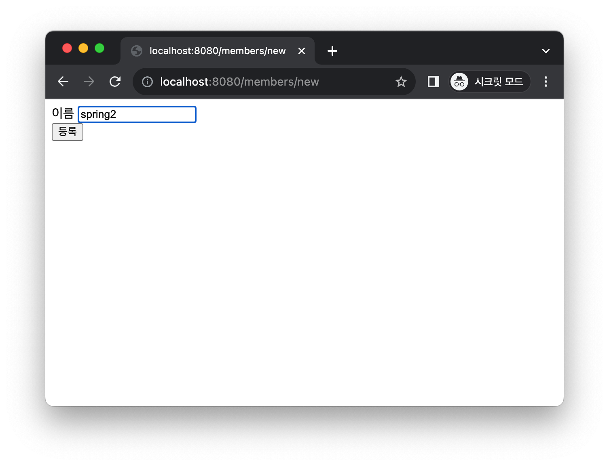
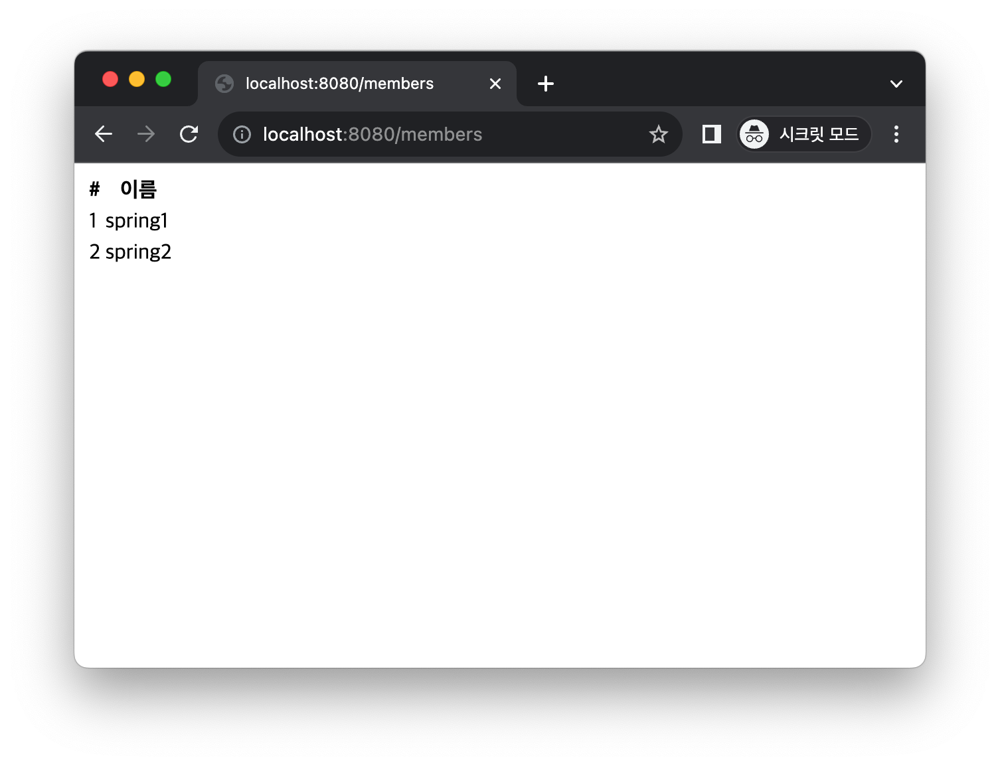
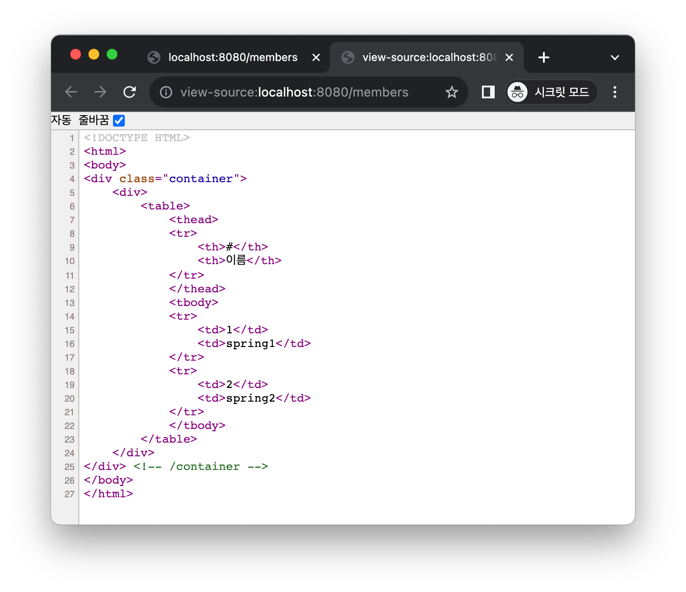

# 조회

    
목표: 회원 목록을 눌렀을 때 회원의 목록이 조회되게 한다.
---
MemberController 클래스에서 회원정보를 조회하는 GetMapping을 선언한다.
memberService.findMembers() 선언후 cmd+opt+v 눌러서 변수 설정.    
model에 addAttribute를 통해서 모든 members를 불어온다.

```java
@GetMapping("/members")
public String list(Model model){
        List<Member> members=memberService.findMembers();
        model.addAttribute("members",members);
        return"mebers/memberList";
}
```

```html
<!DOCTYPE HTML>
<html xmlns:th="http://www.thymeleaf.org">
<body>
<div class="container">
    <div>
        <table>
            <thead>
            <tr>
                <th>#</th>
                <th>이름</th>
            </tr>
            </thead>
            <tbody>
            <tr th:each="member : ${members}">
                <td th:text="${member.id}"></td>
                <td th:text="${member.name}"></td>
            </tr>
            </tbody>
        </table>
    </div>
</div> <!-- /container -->
</body>
</html>
```

#### 실행하기


처음에 실행했을 때는 아무런 정보가 조회되지 않는다.   
저장되어있는 member 정보가 없기 때문이다.  

spring1을 등록한다.  
    
조회하였을 때 spring1이 등록된 것을 확인할 수 있다.

spring2도 등록한다.
    


소스코드를 보았을 때 아래의 타임리프 부분이 member 정보로 채워진 것을 알 수 있다.

```html

<tr th:each="member : ${members}">
    <td th:text="${member.id}"></td>
    <td th:text="${member.name}"></td>
</tr>
```

---
메모리에 저장되어있기 때문에     
서버를 재시작하면, 회원데이터가 모두 사라진다.  
이 데이터를 파일이나 DB에서 저장해야 한다.