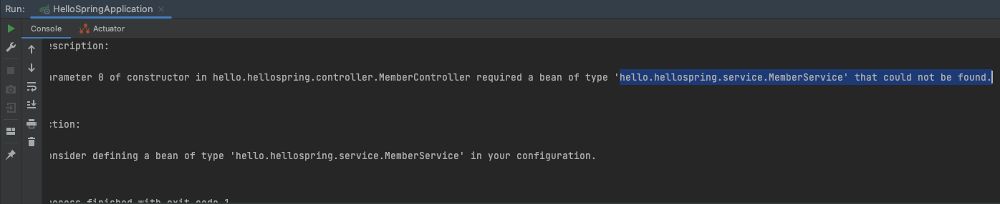
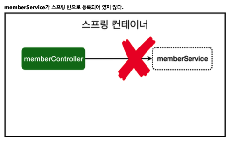
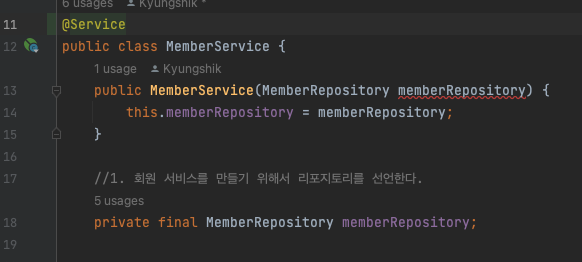
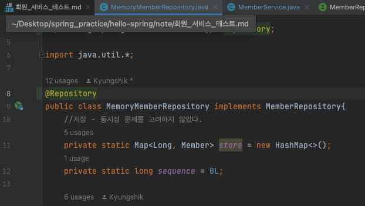
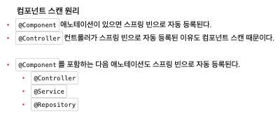
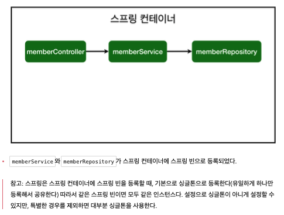

# 컴포넌트 스캔과 자동 의존관계 설정

MembeService와 MemberRepository를 만들었다.   
Member 객체를 만들어서 Service를 통해서 Member를 저장한다.  
Member 리포지토리에서 Member 를 꺼내올 수 있다.   
Test 케이스도 작성완료.
---
다음 할일

- 화면을 붙이기   
  -> controller, view templete이 필요하다.
- MemberService를 통해서 정보를 조회할 수 있다.   
  -> 이를 의존관계가 있다고 말한다.

---

1. MemberController 만들기   
   -> 경로: main/java/hello.spring/controller/MemberController

```java
package hello.hellospring.controller;

import org.springframework.stereotype.Controller;

@Controller
public class MemberController {

}
``` 
이렇게 까지만 하면, 기능은 아무것도 없지만    
스프링 컨테이너가 스프링 창이 뜰 때 스프링 통이 생긴다.   
@Controller가 있으면, 컨트롤러 객체가 생성되어 저장된다.   
그리고 스프링이 이를 관리한다.

```java
package hello.hellospring.controller;

import hello.hellospring.service.MemberService;
import org.springframework.beans.factory.annotation.Autowired;
import org.springframework.stereotype.Controller;

@Controller
public class MemberController {
    private final MemberService memberService;

    @Autowired //맴버 서비스를 가져다가 자동으로 연결시켜준다.
    public MemberController(MemberService memberService) {
        this.memberService = memberService;
    }
}

```
        
새로운 MemberService 인스턴스를 생성했다.   
실행했을 경우에 오류가 발생했다.
    
MemberService 클래스는 순수 자바 언어이다.  
그래서 이를 관리하기 위해서는 @Service를 MemberService 클래스에 선언해야 한다.  

MemberRepository 인터페이스의 구현체인 MemoryMemberRepository클래서에 가서 @Repository를 선언한다.   
    
---
2. 스프링 빈을 등록하는 2가지 방법
- 컴포넌트 스캔과 자동 의존관계 설정
- 자바 코드로 직접 스프링 빈 등록하기
위에서 에노테이션을 선언한 것이 컴포넌트 스캔과 자동 의존관계 설정이다.
   
- 이로 인해 스프링 컨테이너는 아래와 같이 스프링 빈으로 등록된다.
   
---
3. 그러면 아무 패키지에 컴포넌트 스캔을 해도 되는건가?
- 같은 패키지 내에 있는 클래스들만 가능하다.
- 싱글톤으로 등록한다.
- 
