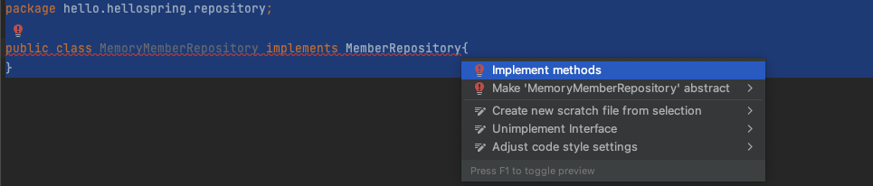
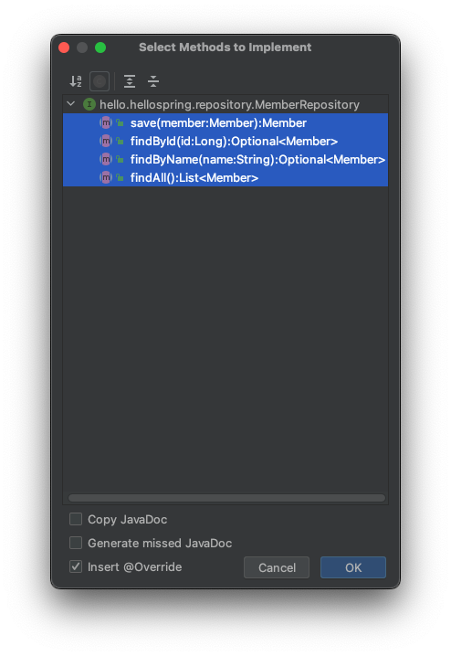

# 회원 도메인과 리포지토리 만들기

1. 회원객체

- main/java/hello.hellospring 패키지에 domain 패키지를 생성한다.
- Member 클래스를 생성한다.

```java
package hello.hellospring.domain;

public class Member {
    //비즈니스 요구사항
    private Long id;
    private String name;

    public Long getId() {
        return id;
    }

    public void setId(Long id) {
        this.id = id;
    }

    public String getName() {
        return name;
    }

    public void setName(String name) {
        this.name = name;
    }
}
```
---
2. 회원 리포지토리

- 리포지토리 : 저장소
- 회원 객체를 저장하는 저장소를 만든다.
- main/java/hello.spring 패키지에 repository 패키지를 생성한다.
- MemberRepository 인터페이스를 생성한다.

```java
package hello.hellospring.repository;

import hello.hellospring.domain.Member;

import java.util.List;
import java.util.Optional;

public interface MemberRepository {
    Member save(Member member); //저장된 회원 반환

    Optional<Member> findById(Long id);

    Optional<Member> findByName(String name);

    List<Member> findAll();
}

```
---
3. 메모리 구현체

- repository 패키지에 MemoryMemberRepository 클래스를 생성한다.

```java
package hello.hellospring.repository;

public class MemoryMemberRepository implements MemberRepository {
}
```

이 상태에서 Option+Enter 를 누른다.



```java
package hello.hellospring.repository;

import hello.hellospring.domain.Member;

import java.util.List;
import java.util.Optional;

public class MemoryMemberRepository implements MemberRepository {
    @Override
    public Member save(Member member) {
        return null;
    }

    @Override
    public Optional<Member> findById(Long id) {
        return Optional.empty();
    }

    @Override
    public Optional<Member> findByName(String name) {
        return Optional.empty();
    }

    @Override
    public List<Member> findAll() {
        return null;
    }
}
//자동적으로 생성된다...(신기)
```

나머지 구현하기

```java
package hello.hellospring.repository;

import hello.hellospring.domain.Member;

import java.util.*;

public class MemoryMemberRepository implements MemberRepository {
    //저장 - 동시성 문제를 고려하지 않았다.
    private static Map<Long, Member> store = new HashMap<>();
    private static long sequence = 0L;

    @Override
    public Member save(Member member) {
        member.setId(++sequence); //ID 값을 세팅한다.
        store.put(member.getId(), member); //store Map 에 저장한다.
        return member;
    }

    @Override
    public Optional<Member> findById(Long id) {
        return Optional.ofNullable(store.get(id));
    }

    @Override
    public Optional<Member> findByName(String name) {
        return store.values().stream()
                .filter(member -> member.getName().equals(name))
                .findAny();
    }

    @Override
    public List<Member> findAll() {
        return new ArrayList<>(store.values());
    }
}

```
--- 
제대로 구현하는지 어떻게 확인할까?
## [테스트케이스를 작성해야 한다](회원_리포지토리_테스트_케이스_작성.md)