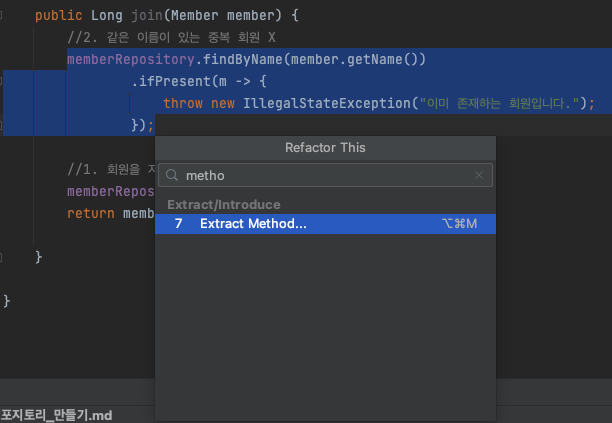
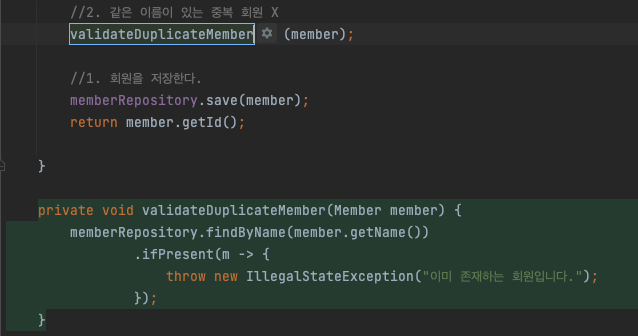

# 회원 서비스 개발

회원 서비스 클래스 만들기  
회원 리포지토리와 도메인을 활용하여서 직접 비즈니스 로직을 작성하는 클래스

---

1. main/java/hello.hellospring 에서 service 패키지를 생성한다.
2. MemberService 클래스를 생성한다.
3. 회원 리포지토리(MemberRepository)를 선언한다.

```java
package hello.hellospring.service;

import hello.hellospring.domain.Member;
import hello.hellospring.repository.MemberRepository;
import hello.hellospring.repository.MemoryMemberRepository;

public class MemberService {
    //1. 회원 서비스를 만들기 위해서 리포지토리를 선언한다.
    private final MemberRepository memberRepository = new MemoryMemberRepository();
}
```

---

4. 회원가입 서비스 개발

```java
package hello.hellospring.service;

import hello.hellospring.domain.Member;
import hello.hellospring.repository.MemberRepository;
import hello.hellospring.repository.MemoryMemberRepository;

import java.util.Optional;

public class MemberService {
    //1. 회원 서비스를 만들기 위해서 리포지토리를 선언한다.
    private final MemberRepository memberRepository = new MemoryMemberRepository();

    //2. 회원가입
    public Long join(Member member) {
        //2. 같은 이름이 있는 중복 회원 X
        /* cmd+opt+v : 자동으로 반환값 불러오기
        Optional<Member> result = memberRepository.findByName(member.getName());
        result.ifPresent(m -> {
            throw new IllegalStateException("이미 존재하는 회원입니다.");
        });
        //모양이 이쁘지 않다. 이를 아래와 같은 코드로 클린하게 나타낼 수 있다.
        */
        memberRepository.findByName(member.getName())
                .ifPresent(m -> {
                    throw new IllegalStateException("이미 존재하는 회원입니다.");
                });

        //1. 회원을 저장한다.
        memberRepository.save(member);
        return member.getId();

    }

}
```

- findByName을 기준으로 로직이 진행되고 있다.
- 이러한 경우에는 method으로 추출하는 것이 바람직하다.
- ctl+t -> method
- 
- validateDuplicateMember 이름의 method를 생성한다.
- 
-

```java
package hello.hellospring.service;

import hello.hellospring.domain.Member;
import hello.hellospring.repository.MemberRepository;
import hello.hellospring.repository.MemoryMemberRepository;

import java.util.List;
import java.util.Optional;

public class MemberService {
    //1. 회원 서비스를 만들기 위해서 리포지토리를 선언한다.
    private final MemberRepository memberRepository = new MemoryMemberRepository();

    //2. 회원가입
    public Long join(Member member) {
        //2. 같은 이름이 있는 중복 회원 X
        validateDuplicateMember(member);
        //1. 회원을 저장한다.
        memberRepository.save(member);
        return member.getId();

    }

    private void validateDuplicateMember(Member member) {
        memberRepository.findByName(member.getName())
                .ifPresent(m -> {
                    throw new IllegalStateException("이미 존재하는 회원입니다.");
                });
    }
}
```

5. 전체 회원 조회

```java
package hello.hellospring.service;

import hello.hellospring.domain.Member;
import hello.hellospring.repository.MemberRepository;
import hello.hellospring.repository.MemoryMemberRepository;

import java.util.List;
import java.util.Optional;

public class MemberService {
    //1. 회원 서비스를 만들기 위해서 리포지토리를 선언한다.
    private final MemberRepository memberRepository = new MemoryMemberRepository();

    //2. 회원가입
    public Long join(Member member) {
        //2. 같은 이름이 있는 중복 회원 X
        validateDuplicateMember(member);
        //1. 회원을 저장한다.
        memberRepository.save(member);
        return member.getId();

    }

    private void validateDuplicateMember(Member member) {
        memberRepository.findByName(member.getName())
                .ifPresent(m -> {
                    throw new IllegalStateException("이미 존재하는 회원입니다.");
                });
    }

    //3. 전체 회원 조회
    public List<Member> findMembers() {
        return memberRepository.findAll();
    }

    public Optional<Member> findOne(Long memberId) {
        return memberRepository.findById(memberId);
    }

}

```

# [테스트 해보기](회원_서비스_테스트.md)
