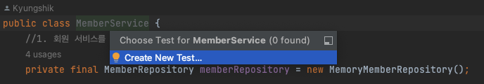
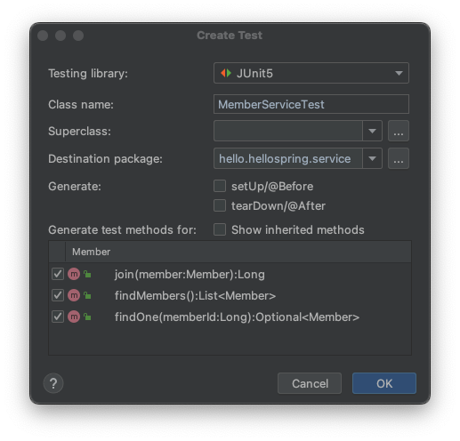
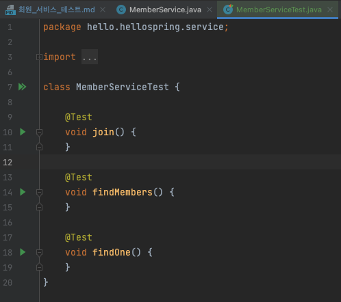
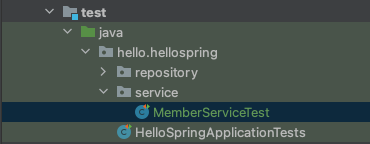
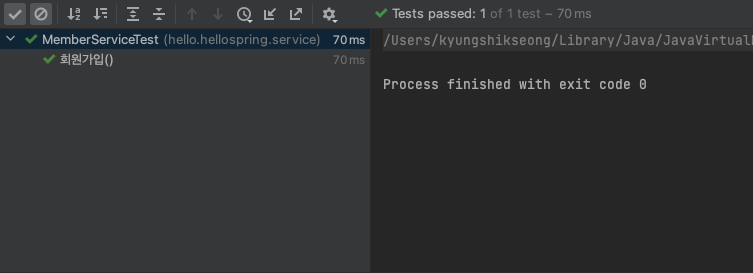

# 회원 서비스 테스트

1. cmd+shift+t
   
   해당 단축키를 누르면 테스트 케이스 생성을 할 수 있다.
   
2. 자동생성 된 MemberServiceTest.java
   
   생성경로   
   
3. 테스트케이스 작성하기   
- 기본적으로 product 코드가 직접적으로 나가는 것이 아니라면,
- 가독성을 위해서 한글로 테스트케이스를 작성해도 된다.
- 테스트 코드 문법: given, when, then
  - given : 이러한 상황이 주어졌다. <이 데이터를 사용하는 구나>
  - when : 이를 실행했다. <이것을 검증하는 구나>
  - then : 이러한 결과가 나왔다. <검증 부분이구나>
- 이러한 패턴을 사용하면서, 상황에 따라서 유연하게 변형해야 한다.

```java
package hello.hellospring.service;

import hello.hellospring.domain.Member;
import org.assertj.core.api.Assertions;
import org.junit.jupiter.api.Test;

import java.util.Optional;

import static org.junit.jupiter.api.Assertions.*;

class MemberServiceTest {

    MemberService memberService = new MemberService();

    @Test
    void 회원가입() {
        //given
        Member member = new Member();
        member.setName("hello");

        //when
        Long savedId = memberService.join(member);

        //then
        Member findMember = memberService.findOne(savedId).get();
        Assertions.assertThat(member.getName()).isEqualTo(findMember.getName());
    }

    @Test
    void findMembers() {
    }

    @Test
    void findOne() {
    }
}
```
   
- 정상적으로 테스트케이스를 통과한 것을 알 수 있다.
- 그러나 테스트에서 가장 중요한 것은 일반적이지 않은 상황에서 테스트를 통과할 수 있는가에 대한 것이다.
- 중복회원 로직에 대한 예외를 잘 검증할 수 있는지 확인해야 한다.
````java
package hello.hellospring.service;

import hello.hellospring.domain.Member;
import hello.hellospring.repository.MemoryMemberRepository;
import org.assertj.core.api.Assertions;
import org.junit.jupiter.api.AfterEach;
import org.junit.jupiter.api.BeforeEach;
import org.junit.jupiter.api.Test;

import java.util.Optional;

import static org.assertj.core.api.Assertions.*;
import static org.junit.jupiter.api.Assertions.*;

class MemberServiceTest {

    MemberService memberService;
    MemoryMemberRepository memberRepository = new MemoryMemberRepository();

    @BeforeEach
    public void beforeEach(){
        memberRepository = new MemoryMemberRepository();
        memberService = new MemberService(memberRepository);
    }

    @AfterEach
    public void afterEach() {
        memberRepository.clearStore();
    }

    @Test
    void 회원가입() {
        //given
        Member member = new Member();
        member.setName("hello");

        //when
        Long savedId = memberService.join(member);

        //then
        Member findMember = memberService.findOne(savedId).get();
        assertThat(member.getName()).isEqualTo(findMember.getName());
    }

    @Test
    public void 중복_회원_예외() {
        //given
        Member member1 = new Member();
        member1.setName("spring");

        Member member2 = new Member();
        member2.setName("spring");

        //when
        memberService.join(member1);
        IllegalStateException e = assertThrows(IllegalStateException.class, () -> memberService.join(member2));
        assertThat(e.getMessage()).isEqualTo("이미 존재하는 회원입니다.");


        //then
    }

    @Test
    void findMembers() {
    }

    @Test
    void findOne() {
    }
}
````